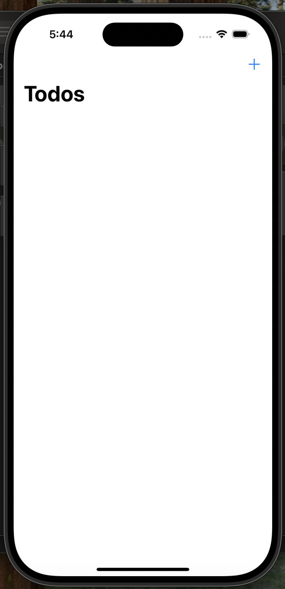
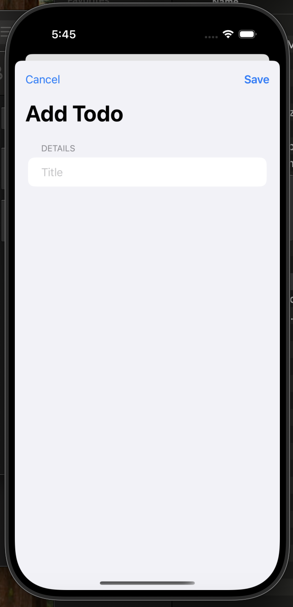
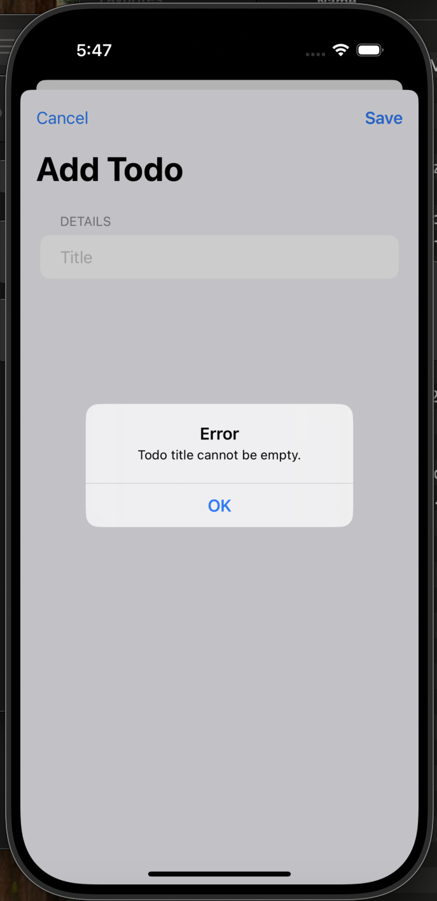
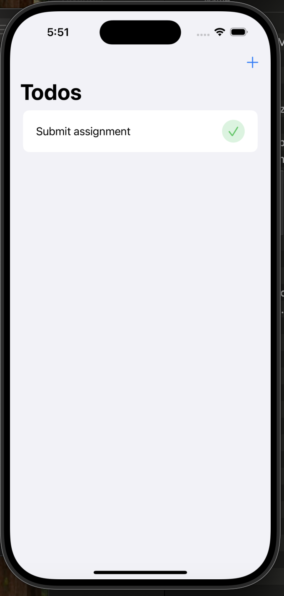
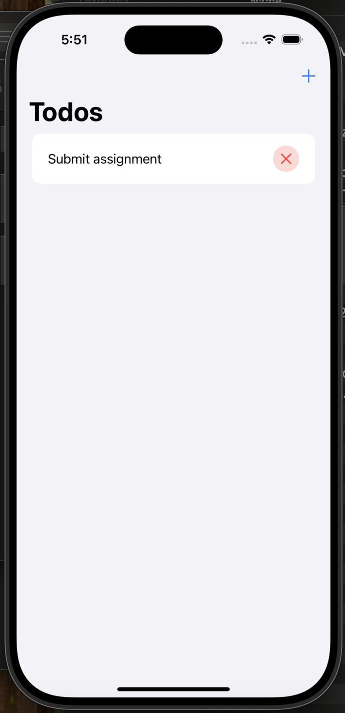
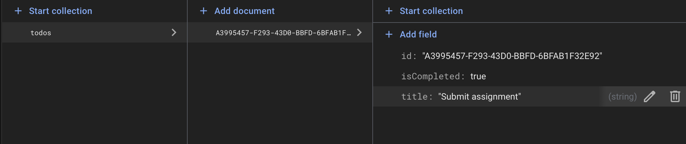
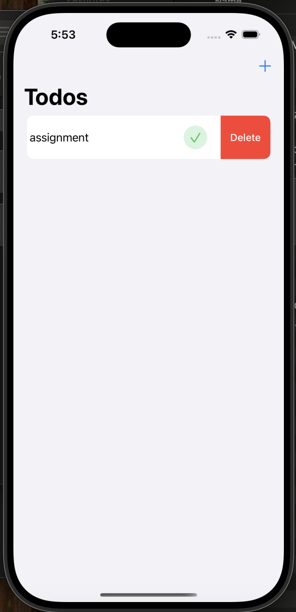
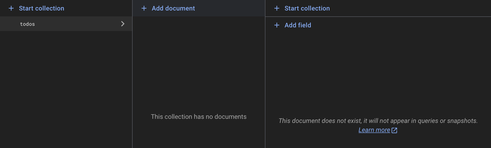

# Firestore todo app

## Description
This is a user-friendly todo app built using SwiftUI and Firestore. It allows users to create, update and delete todos and updates the database accordingly. 

## Features
### 1. View todos
The homepage displays all todos once they are added. From there, one can view the title and status of the todo, and swipe to delete it.

### 2. Add todos
A sheet appears, allowing the user to enter the title of a todo. It will not be created unless a title is added.

### 3. Update status
By pressing on the checkmark or cross, the todo's status changes from completed to incomplete, and vice-versa.

The Firestore database is updated accordingly:

### 4. Delete todos
Swipe left on the todo to delete it.

The todo is deleted from the database as well:

